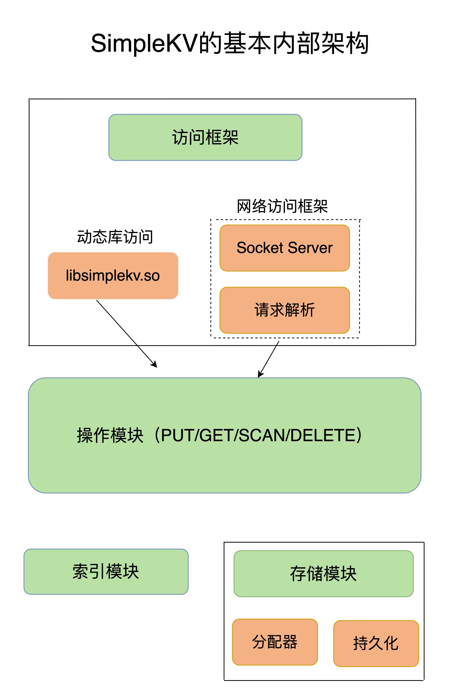
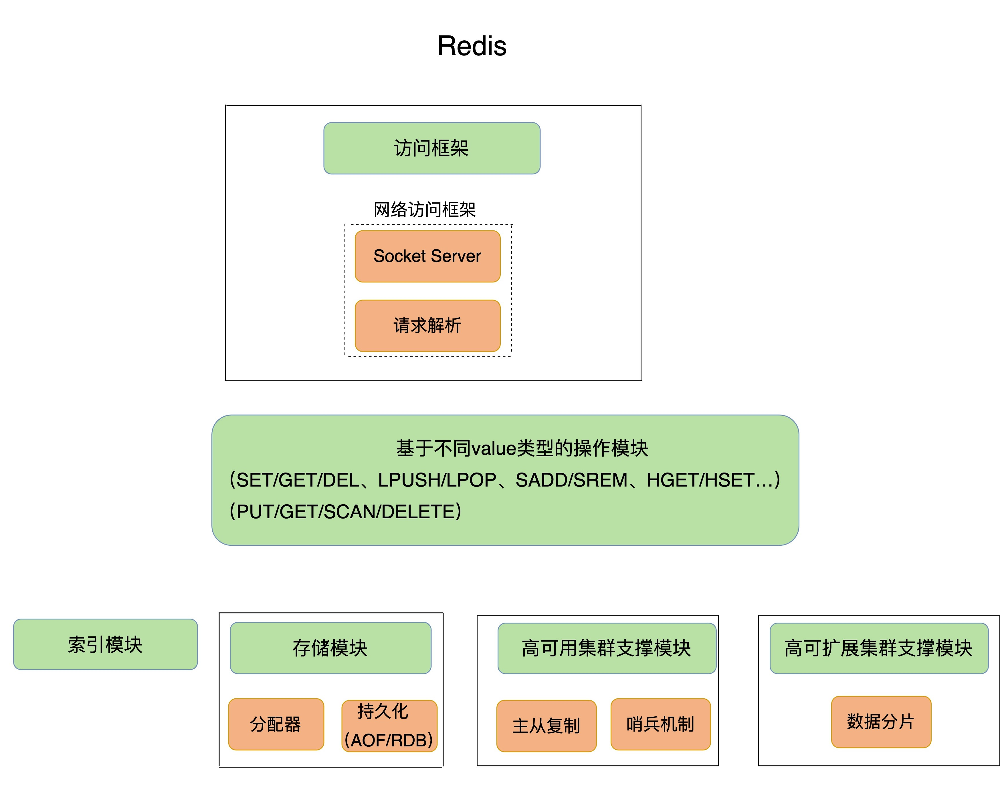

## Redis的基本架构

### 一、可以存储哪些数据结构

对于键值数据库而言，基本的数据模型是 key-value 模型。

不同键值数据库支持的 key 类型一般差异不大，而 value 类型则有较大差别。在对键值数据库进行选型时，一个重要的考虑因素是它支持的 value 类型。

- Memcached 支持的 value 类型仅为 String 类型。
-  Redis 支持的 value 类型包括了 String、哈希表、列表、集合等。**Redis 能够在实际业务场景中得到广泛的应用，就是得益于支持多样化类型的 value。**

### 二、可以对数据做什么操作？

SimpleKV 需要支持的 3 种基本操作，即 PUT、GET 和 DELETE。

- PUT：新写入或更新一个 key-value 对；
- GET：根据一个 key 读取相应的 value 值；
- DELETE：根据一个 key 删除整个 key-value 对。

（注：有些键值数据库的新写 / 更新操作叫 SET）

- SCAN：根据一段 key 的范围返回相应的 value 值。

### 三、键值对的保存

如何进行设计选择，通常需要考虑键值数据库的主要应用场景。

比如，缓存场景下的数据需要能快速访问但允许丢失，那么，用于此场景的键值数据库通常采用内存保存键值数据。Memcached 和 Redis 都是属于内存键值数据库。对于 Redis 而言，缓存是非常重要的一个应用场景。

### 四、键值对数据库的基本组件

一个键值数据库包括了**访问框架、索引模块、操作模块和存储模块**四部分。

1. #### 访问模式

   访问模式通常有两种：

   - 一种是通过函数库调用的方式供外部应用使用，比如，上图中的 libsimplekv.so，是以动态链接库的形式链接到自己的程序中，提供键值存储功能；
   - 另一种是通过网络框架以 Socket 通信的形式对外提供键值对操作，这种形式可以提供广泛的键值存储服务。

   不同的键值数据库服务器和客户端交互的协议并不相同，我们在对键值数据库进行二次开发、新增功能时，必须要了解和掌握键值数据库的通信协议，这样才能开发出兼容的客户端。

   实际的键值数据库也基本采用上述两种方式：

   - RocksDB 以动态链接库的形式使用（RocksDB 是用于键值数据的高性能嵌入式数据库）
   - Memcached 和 Redis 则是通过网络框架访问

   通过网络框架提供键值存储服务，一方面扩大了键值数据库的受用面，但另一方面，也给键值数据库的性能、运行模型提供了不同的设计选择，带来了一些潜在的问题。键值数据库网络框架接收到网络包，并按照相应的协议进行解析之后，就可以知道，客户端想写入一个键值对，并开始实际的写入流程。

   此时会遇到一个系统设计上的问题，简单来说，就是网络连接的处理、网络请求的解析，以及数据存取的处理，是用一个线程、多个线程，还是多个进程来交互处理呢？该如何进行设计和取舍呢？

2. #### I/O模型

   不同的 I/O 模型对键值数据库的性能和可扩展性会有不同的影响。

   如果一个线程既要处理网络连接、解析请求，又要完成数据存取，一旦某一步操作发生阻塞，整个线程就会阻塞住，这就降低了系统响应速度。如果采用不同线程处理不同操作，那么，某个线程被阻塞时，其他线程还能正常运行。但是，不同线程间如果需要访问共享资源，那又会产生线程竞争，也会影响系统效率。

   - Redis 是单线程

3. #### 索引模块

   索引的作用是让键值数据库根据 key 找到相应 value 的存储位置，进而执行操作。索引的类型有很多，常见的有哈希表、B+ 树、字典树等。不同的索引结构在性能、空间消耗、并发控制等方面具有不同的特征。不同键值数据库采用的索引并不相同。

   - Memcached 和 Redis 采用哈希表作为 key-value 索引
   - RocksDB 则采用跳表作为内存中 key-value 的索引

   内存键值数据库（例如 Redis）采用哈希表作为索引，很大一部分原因在于，其键值数据基本都是保存在内存中的，而内存的高性能随机访问特性可以很好地与哈希表 O(1) 的操作复杂度相匹配。

4. #### 分配器

   找到存储位置之后，需要进一步执行的操作的具体逻辑会有所差异。

   - 对于 GET/SCAN 操作而言，此时根据 value 的存储位置返回 value 值即可；
   - 对于 PUT 一个新的键值对数据而言，需要为该键值对分配内存空间；
   - 对于 DELETE 操作，需要删除键值对，并释放相应的内存空间，这个过程由分配器完成。

   常用的内存分配器 glibc 的 malloc 和 free。键值数据库的键值对通常大小不一，glibc 的分配器在处理随机的大小内存块分配时，表现并不好。一旦保存的键值对数据规模过大，就可能会造成较严重的内存碎片问题。因此分配器是键值数据库中的一个关键因素。Redis 的内存分配器提供了多种选择，分配效率也不一样。

5. #### 持久化

   持久化可以使得系统在重启后还可以重新提供服务。这里有两种方式进行持久化保存。

   - 一种方式是，对于每一个键值对，都对其进行落盘保存，这虽然让数据更加可靠，但是，因为每次都要写盘，性能会受到很大影响。
   - 另一种方式是，周期性地把内存中的键值数据保存到文件中，这样可以避免频繁写盘操作的性能影响。但是，一个潜在的代价是数据仍然有丢失的风险。

   Redis 为持久化提供了诸多的执行机制和优化改进。

以上便是一个基本的键值数据库需要的组件。为了支持更加丰富的业务场景，Redis 对这些组件或者功能进行了扩展，或者说是进行了精细优化，从而满足了功能和性能等方面的要求。

### 五、Redis的基本架构

- Redis 主要通过网络框架进行访问，而不再是动态库了，这也使得 Redis 可以作为一个基础性的网络服务进行访问，扩大了 Redis 的应用范围。
- Redis 数据模型中的 value 类型很丰富，因此也带来了更多的操作接口，例如面向列表的 LPUSH/LPOP，面向集合的 SADD/SREM 等。后面再value 模型背后的数据结构和操作效率，以及它们对 Redis 性能的影响。
- Redis 的持久化模块能支持两种方式：日志（AOF）和快照（RDB），这两种持久化方式具有不同的优劣势，影响到 Redis 的访问性能和可靠性。
- Redis 支持高可靠集群和高可扩展集群，因此，Redis 中包含了相应的集群功能支撑模块。

​	
