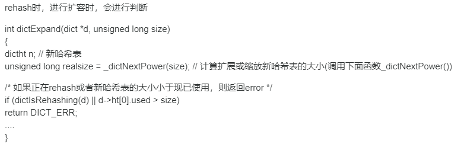
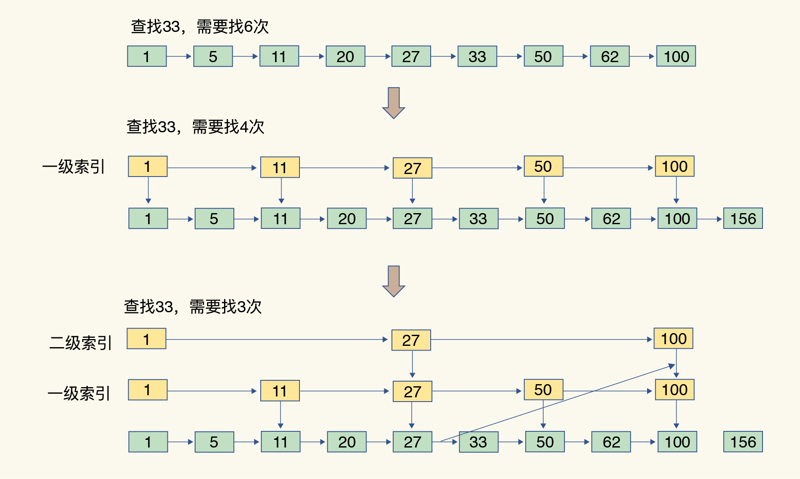

## Redis的数据结构

### 一、为什么Redis 能有这么突出的表现?

- 一方面，这是因为它是内存数据库，所有操作都在内存上完成，内存的访问速度本身就很快。
- 另一方面，这要归功于它的数据结构。这是因为，键值对是按一定的数据结构来组织的，操作键值对最终就是对数据结构进行增删改查操作，所以高效的数据结构是 Redis快速处理数据的基础。

### 二、Redis的底层数据结构

我们常说的Redis的数据结构有五种：String（字符串）、List（列表）、Hash（哈希）、Set（集合）和 Sorted Set（有序集合）。其实，这些只是 Redis 键值对中值的数据类型，也就是数据的保存形式。而Redis的底层数据结构一共有 6 种，分别是简单动态字符串、双向链表、压缩列表、哈希表、跳表和整数数组。

可以看到，String 类型的底层实现只有一种数据结构，也就是简单动态字符串。而 List、Hash、Set 和 Sorted Set 这四种数据类型，都有两种底层实现结构。通常情况下，会把这四种类型称为集合类型，它们的特点是一个键对应了一个集合的数据。

### 三、Redis键值的数据结构

为了实现从键到值的快速访问，Redis 使用了一个哈希表来保存所有键值对。一个哈希表，其实就是一个数组，数组的每个元素称为一个哈希桶。一个哈希表是由多个哈希桶组成的，每个哈希桶中保存了键值对数据。哈希桶中的元素保存的并不是值本身，而是指向具体值的指针。这也就是说，不管值是 String，还是集合类型，哈希桶中的元素都是指向它们的指针。

哈希桶中的 entry 元素中保存了* key和* value指针，分别指向了实际的键和值，这样一来，即使值是一个集合，也可以通过* value指针被查找到。

哈希表的最大好处很明显，就是可以用 O(1) 的时间复杂度来快速查找到键值对，只需要计算键的哈希值，就可以知道它所对应的哈希桶位置，然后就可以访问相应的 entry 元素。虽然哈希表的 O(1) 复杂度可以快速查找到数据，但是也有一个潜在的风险：哈希表的冲突问题和 rehash 可能带来的操作阻塞。

Redis通过哈希冲突链的方式去解决hash冲突的，同一个哈希桶中的多个元素用一个链表来保存，它们之间依次用指针连接。如果哈希表里写入的数据越来越多，哈希冲突可能也会越来越多，这就会导致某些哈希冲突链过长，进而导致这个链上的元素查找耗时长，效率降低。这个时候，Redis 会对哈希表做 rehash 操作。rehash 也就是增加现有的哈希桶数量，让逐渐增多的 entry 元素能在更多的桶之间分散保存，减少单个桶中的元素数量，从而减少单个桶中的冲突。

（Java的 HashMap 也是通过哈希冲突链的方式去解决hash冲突的，当然在Java8之后，当链达到一定长度之后会转成红黑树。）

Redis为了使 rehash 操作更高效，Redis 默认使用了两个全局哈希表：哈希表1 和哈希表2。一开始，当你刚插入数据时，默认使用哈希表1，此时的哈希表2 并没有被分配空间。随着数据逐步增多，Redis 开始执行 rehash，这个过程分为三步：

	1. 给哈希表2 分配更大的空间，例如是当前哈希表1 大小的两倍；
 2. 把哈希表1 中的数据重新映射并拷贝到哈希表2 中；
 3. 释放哈希表1 的空间。

第二步涉及大量的数据拷贝，如果一次性把哈希表 1 中的数据都迁移完，会造成 Redis 线程阻塞，无法服务其他请求。于是为了避免这个问题，Redis 采用了渐进式 rehash。

就是在第二步拷贝数据的时候，Redis 仍然正常处理客户端请求，每处理一个请求时，从哈希表 1 中的第一个索引位置开始，顺带着将这个索引位置上的所有 entries 拷贝到哈希表 2 中；等处理下一个请求时，再顺带拷贝哈希表 1 中的下一个索引位置的 entries。

这样就巧妙地把一次性大量拷贝的开销，分摊到了多次处理请求的过程中，避免了耗时操作，同时也保证了数据的快速访问。

**（在rehash过程中，新的请求操作到来是如何操作的？）**

在进行渐进式 rehash 的过程中，会同时使用新旧两个哈希表， 所以在渐进式rehash进行期间，删除（delete）、查找（find）、更新（update）等操作会在两个哈希表上进行： 比如说， 查找一个键的话， 程序会先在旧表里面进行查找， 如果没找到的话， 就会继续到新表里面进行查找， 诸如此类。

另外， 在渐进式rehash执行期间， 新添加的键值对一律会被保存到新表里面， 而旧表则不再进行任何添加操作： 这一措施保证了旧表包含的键值对数量会只减不增， 并随着rehash操作的执行而最终变成空表。

**（如果旧表在rehash的过程中，新表却再次需要再次扩容了呢？）**

Redis在设计的时候也想到了这一点，它在扩容的时候会进行判断，如果发现新表还在rehash的过程中，那么新表的扩容不会继续执行。

Redis 的键和值就是这样通过哈希表进行组织的。对于 String 类型来说，找到哈希桶就能直接增删改查了，所以，哈希表的 O(1) 操作复杂度也就是它的复杂度了。

对于集合类型来说，即使找到哈希桶，确定了具体的entry，还要在集合中再进一步操作。下面就来讲一下集合数据的操作效率以及相应的数据结构。

### 四、集合类型的数据结构

集合类型的底层数据结构主要有 5 种：

- 整数数组
- 双向链表
- 哈希表
- 压缩列表
- 跳表

数组、链表、哈希表这三个我们平时用的都挺多的，重点讲述一下压缩列表和跳表。

**压缩列表**实际上类似于一个数组，数组中的每一个元素都对应保存一个数据。和数组不同的是，压缩列表在表头有三个字段 zlbytes、zltail 和 zllen，分别表示列表长度、列表尾的偏移量和列表中的 entry 个数；压缩列表在表尾还有一个 zlend，表示列表结束。

在压缩列表中，如果我们要查找定位第一个元素和最后一个元素，可以通过表头三个字段的长度直接定位，复杂度是 O(1)。而查找其他元素时，就没有这么高效了，只能逐个查找，此时的复杂度就是 O(N) 了。

**跳表：**有序链表只能逐一查找元素，导致操作起来非常缓慢，于是就出现了跳表。具体来说，跳表在链表的基础上，增加了多级索引，通过索引位置的几个跳转，实现数据的快速定位，如下图所示：

如果要在链表中查找 33 这个元素，只能从头开始遍历链表，查找 6 次，直到找到 33 为止。此时，复杂度是 O(N)，查找效率很低。

为了提高查找速度，增加一级索引：从第一个元素开始，每两个元素选一个出来作为索引。这些索引再通过指针指向原始的链表。例如，从前两个元素中抽取元素 1 作为一级索引，从第三、四个元素中抽取元素 11 作为一级索引。此时，只需要 4 次查找就能定位到元素 33 了。

如果还想再快，可以再增加二级索引：从一级索引中，再抽取部分元素作为二级索引。例如，从一级索引中抽取 1、27、100 作为二级索引，二级索引指向一级索引。这样，只需要 3 次查找，就能定位到元素 33 了。

可以看到，这个查找过程就是在多级索引上跳来跳去，最后定位到元素。这也正好符合“跳”表的叫法。当数据量很大时，跳表的查找复杂度就是 O(logN)。

下面给出了这五种数据结构的时间复杂度：

### 五、集合类型的操作复杂度

集合的操作类型有很多，有读写单个集合元素的，例如 HGET、HSET，也有操作多个元素的，例如 SADD，还有对整个集合进行遍历操作的，例如 SMEMBERS。

**复杂度操作四句口诀：**

- 单元素操作是基础；
- 范围操作非常耗时；
- 统计操作通常高效；
- 例外情况只有几个。

1. 单元素操作，是指每一种集合类型对单个数据实现的增删改查操作，例如：

   - Hash 类型的 HGET、HSET 和 HDEL。HGET、HSET 和 HDEL 是对哈希表做操作，所以它们的复杂度都是 O(1)；
   - Set 类型的 SADD、SREM、SRANDMEMBER 。Set 类型用哈希表作为底层数据结构时，它的 SADD、SREM、SRANDMEMBER 复杂度也是 O(1)。

   集合类型支持同时对多个元素进行增删改查，例如 Hash 类型的 HMGET 和 HMSET，Set 类型的 SADD 也支持同时增加多个元素。此时，这些操作的复杂度，就是由单个元素操作复杂度和元素个数决定的。例如，HMSET 增加 M 个元素时，复杂度就从 O(1) 变成 O(M) 了。

2. 范围操作，是指集合类型中的遍历操作，可以返回集合中的所有数据，比如 Hash 类型的 HGETALL 和 Set 类型的 SMEMBERS，或者返回一个范围内的部分数据，比如 List 类型的 LRANGE 和 ZSet 类型的 ZRANGE。这类操作的复杂度一般是 O(N)，比较耗时，我们应该尽量避免。

   Redis 从 2.8 版本开始提供了 SCAN 系列操作（包括 HSCAN，SSCAN 和 ZSCAN），这类操作实现了渐进式遍历，每次只返回有限数量的数据。这样一来，相比于 HGETALL、SMEMBERS 这类操作来说，就避免了一次性返回所有元素而导致的 Redis 阻塞。

3. 统计操作，是指集合类型对集合中所有元素个数的记录，例如 LLEN 和 SCARD。这类操作复杂度只有 O(1)，这是因为当集合类型采用压缩列表、双向链表、整数数组这些数据结构时，这些结构中专门记录了元素的个数统计，因此可以高效地完成相关操作。

4. 某些数据结构的特殊记录，例如：

   - 压缩列表和双向链表都会记录表头和表尾的偏移量。这样一来，对于 List 类型的 LPOP、RPOP、LPUSH、RPUSH 这四个操作来说，它们是在列表的头尾增删元素，这就可以通过偏移量直接定位，所以它们的复杂度也只有 O(1)，可以实现快速操作。

### 六、总结

Redis 中用来保存每个键和值的全局哈希表结构，也包括了支持集合类型实现的双向链表、压缩列表、整数数组、哈希表和跳表这五大底层结构。

Redis 之所以能快速操作键值对。

- 一方面是因为 O(1) 复杂度的哈希表被广泛使用，包括 String、Hash 和 Set，它们的操作复杂度基本由哈希表决定。
- 另一方面，Sorted Set 也采用了 O(logN) 复杂度的跳表。不过，集合类型的范围操作，因为要遍历底层数据结构，复杂度通常是 O(N)。这里建议是：用**其他命令来替代**，例如可以用 SCAN 来代替，避免在 Redis 内部产生费时的全集合遍历操作。
- 复杂度较高的 List 类型，它的两种底层实现结构：双向链表和压缩列表的操作复杂度都是 O(N)。因此建议：因地制宜地使用 List 类型。例如，既然它的 POP/PUSH 效率很高，那么就将它主要用于 FIFO 队列场景，而不是作为一个可以随机读写的集合。

Redis 数据类型丰富，每个类型的操作繁多，通常无法一下子记住所有操作的复杂度。所以，最好的办法就是掌握原理，以不变应万变。一旦掌握了数据结构基本原理，就可以从原理上推断不同操作的复杂度，即使这个操作不一定熟悉。也能快速合理地做出选择了。

**问题： 整数数组和压缩列表在查找时间复杂度方面并没有很大的优势，那为什么 Redis 还会把它们作为底层数据结构呢？**

两方面原因：

1. 内存利用率，数组和压缩列表都是非常紧凑的数据结构，它比链表占用的内存要更少。Redis是内存数据库，大量数据存到内存中，此时需要做尽可能的优化，提高内存的利用率。因为元素是挨个连续放置的，就不用再通过额外的指针把元素串接起来，这就避免了额外指针带来的空间开销。
2. 数组对CPU高速缓存支持更友好，所以Redis在设计时，集合数据元素较少情况下，默认采用内存紧凑排列的方式存储，同时利用CPU高速缓存不会降低访问速度。当数据元素超过设定阈值后，避免查询时间复杂度太高，转为哈希和跳表数据结构存储，保证查询效率。

Redis 之所以采用不同的数据结构，其实是在性能和内存使用效率之间进行的平衡。

