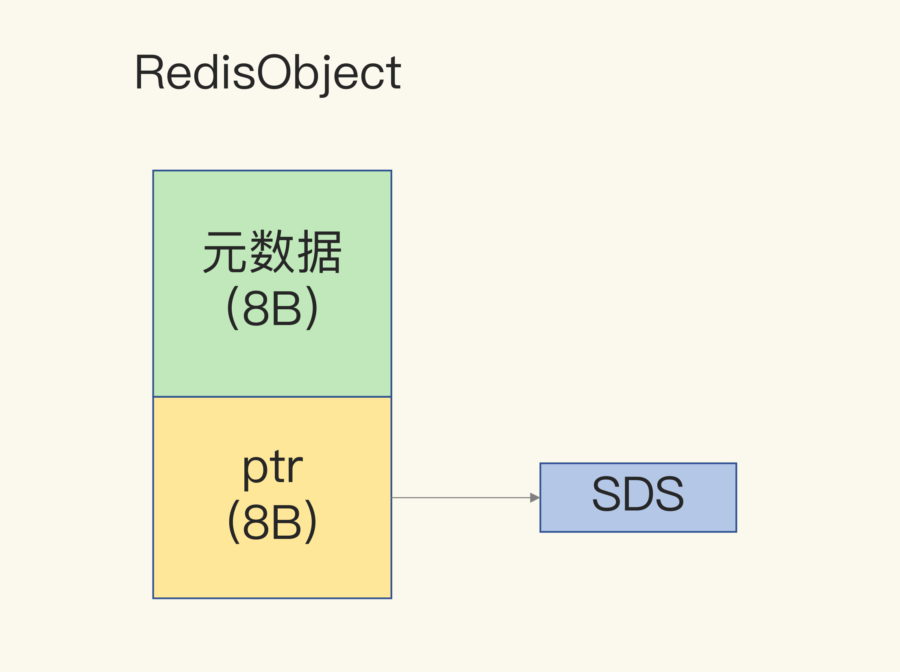

## String的内存空间

### 一、为什么String类型内存开销大

当保存64 位有符号整数时，String 类型会把它保存为一个 8 字节的 Long 类型整数，这种保存方式通常也叫作 int 编码方式。

当保存的数据中包含字符时，String 类型就会用简单动态字符串（Simple Dynamic String，SDS）结构体来保存，如下图所示

- **buf**：字节数组，保存实际数据。为了表示字节数组的结束，Redis 会自动在数组最后加一个“\0”，这就会额外占用 1 个字节的开销。
- **len**：占 4 个字节，表示 buf 的已用长度。
- **alloc**：也占个 4 字节，表示 buf 的实际分配长度，一般大于 len。

可以看到，在 SDS 中，buf 保存实际数据，而 len 和 alloc 本身其实是 SDS 结构体的额外开销。

另外，对于 String 类型来说，除了 SDS 的额外开销，还有一个来自于 RedisObject 结构体的开销。

Redis 的数据类型有很多，而且，不同数据类型都有些相同的元数据要记录（比如最后一次访问的时间、被引用的次数等），所以，Redis 会用一个 RedisObject 结构体来统一记录这些元数据，同时指向实际数据。

一个 RedisObject 包含了 8 字节的元数据和一个 8 字节指针，这个指针再进一步指向具体数据类型的实际数据所在，例如指向 String 类型的 SDS 结构所在的内存地址，可以看一下下面的示意图。

为了节约空间，Redis 还对 Long 类型整数和 SDS 的内存布局做了专门的设计。

一方面，当保存的是 Long 类型整数时，RedisObject 中的指针就直接赋值为整数数据了，这样就不用额外的指针再指向整数了，节省了指针的空间开销。

另一方面，当保存的是字符串数据，并且字符串小于等于 44 字节时，RedisObject 中的元数据、指针和 SDS 是一块连续的内存区域，这样就可以避免内存碎片。这种布局方式也被称为 embstr 编码方式。

当字符串大于 44 字节时，SDS 的数据量就开始变多了，Redis 就不再把 SDS 和 RedisObject 布局在一起了，而是会给 SDS 分配独立的空间，并用指针指向 SDS 结构。这种布局方式被称为 raw 编码模式。

三种编码模式的示意图：

如果是10位的数字进行key和value进行存储，那会采用int编码的RedisObject保存，此时int编码的元数据部分占8字节，指针部分被直接赋值为 8 字节的整数了。此时，每个 ID 会使用 16 字节，加起来一共是 32 字节。

Redis 会使用一个全局哈希表保存所有键值对，哈希表的每一项是一个 dictEntry 的结构体，用来指向一个键值对。dictEntry 结构中有三个 8 字节的指针，分别指向 key、value 以及下一个 dictEntry，三个指针共 24 字节，如下图所示：

Redis 使用的内存分配库Jemalloc在分配内存时，会根据申请的字节数 N，找一个比 N 大，但是最接近 N 的 2 的幂次数作为分配的空间，这样可以减少频繁分配的次数。如果申请 6 字节空间，jemalloc 实际会分配 8 字节空间；如果申请 24 字节空间，jemalloc 则会分配 32 字节。所以，刚刚说场景里，dictEntry 结构就占用了 32 字节。

因此，如果是10位的数字进行key和value进行存储，那么一共需要花费64个字节。有效信息只有 16 字节，使用 String 类型保存时，却需要 64 字节的内存空间，有 48 字节都没有用于保存实际的数据。

### 二、Hash的底层实现结构及判定

Hash 类型的两种底层实现结构，分别是压缩列表和哈希表。

那么，Hash 类型底层结构什么时候使用压缩列表，什么时候使用哈希表呢？其实，Hash 类型设置了用压缩列表保存数据时的两个阈值，一旦超过了阈值，Hash 类型就会用哈希表来保存数据了。

这两个阈值分别对应以下两个配置项：

- hash-max-ziplist-entries：表示用压缩列表保存时哈希集合中的最大元素个数。
- hash-max-ziplist-value：表示用压缩列表保存时哈希集合中单个元素的最大长度。

当往 Hash 集合中写入的元素个数超过了 hash-max-ziplist-entries，或者写入的单个元素大小超过了 hash-max-ziplist-value，Redis 就会自动把 Hash 类型的实现结构由压缩列表转为哈希表。

一旦从压缩列表转为了哈希表，Hash 类型就会一直用哈希表进行保存，而不会再转回压缩列表了。在节省内存空间方面，哈希表就没有压缩列表那么高效了。

为了能充分使用压缩列表的精简内存布局，一般要控制保存在 Hash 集合中的元素个数。

