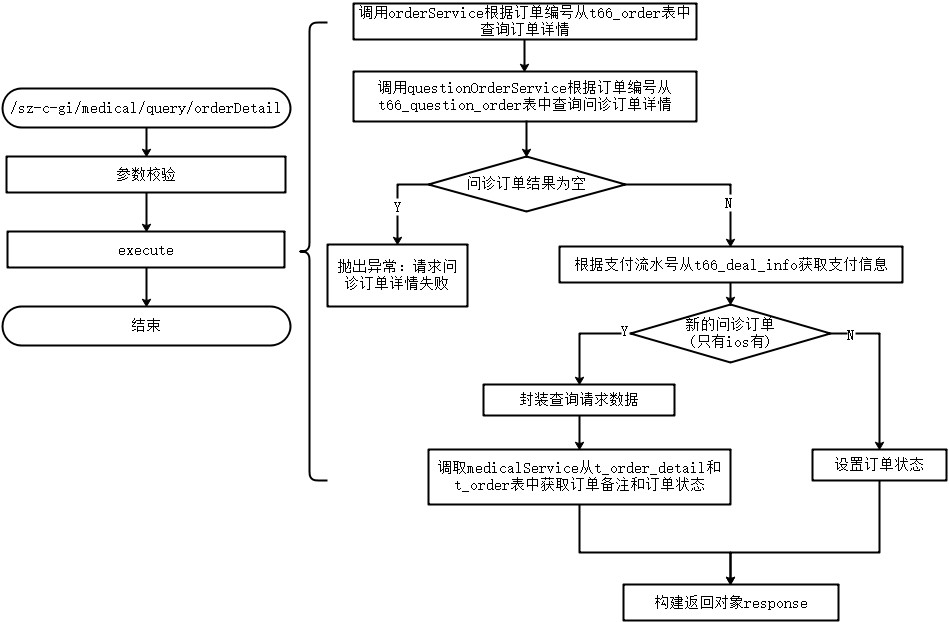
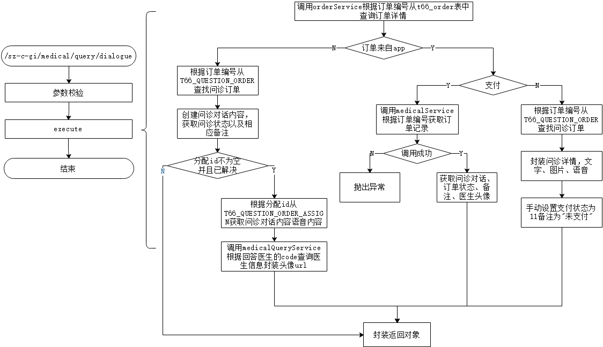
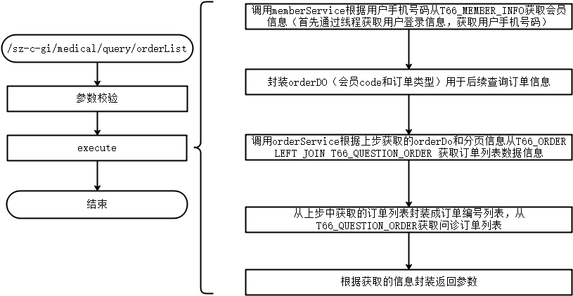
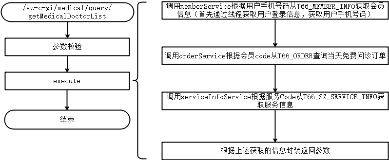
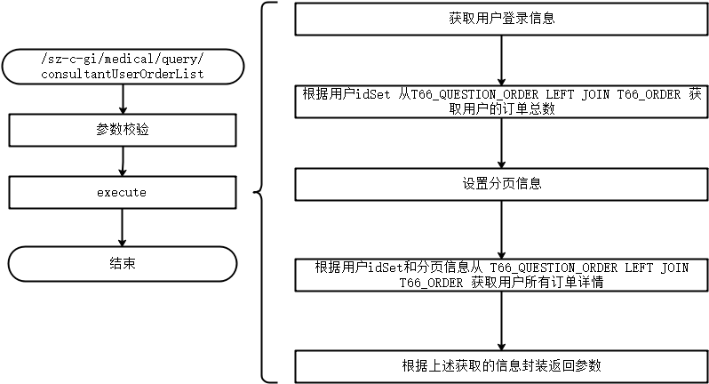

### c-gi Medical相关接口梳理

#### 零、总流程

1. controller调用相应的处理进程类process的process方法，并传入对应的Enums，以及相应的请求参数。

2. context-sz-gi-biz.xml中定义了Map bean对象以供调用，其中每个Map对应相应的一个处理模块，map内部的键值对以Enum以及该处理逻辑所对应的处理Nodes节点。

3. process类中有，有相应处理进程的方法，通过调用map bean对象中相应的Key值，获取处理Node，将传入的请求参数DTO封装成Context，然后执行node类中的execute方法，同时将结果存入context中的Map中，最后返回context中存数据的map。

4. 主要的处理逻辑在node的execute方法里。

   

##### 公共请求参数

| 参数名      | 类型    | 允许为空 | 描述          |
| ----------- | ------- | -------- | ------------- |
| szUserId    | String  | 否       | 登录用户ID    |
| szUserToken | String  | 否       | 登录用户token |
| szpl        | String  | 否       | 善诊应用平台  |
| traceId     | String  | 否       | 内部跟踪id    |
| traceDate   | Long    | 否       | 请求时间      |
| language    | Boolean | 否       | 双语标识      |

##### 公共返回参数

| 参数名  | 类型   | 允许为空 | 描述                                     |
| ------- | ------ | -------- | ---------------------------------------- |
| SZ_BODY | Object | 否       | 返回Body，下方所列返回参数都包在此内     |
| SZ_HEAD | Object | 否       | 返回Head，基本返回参数，返回接口调用信息 |

##### SZ_HEAD

| 参数名    | 类型   | 允许为空 | 描述         |
| --------- | ------ | -------- | ------------ |
| RESP_CODE | String | 否       | 应答码       |
| RESP_MSG  | String | 否       | 应答信息     |
| RESP_INFO | String | 否       | 应答详细信息 |
| TRACE_ID  | String | 否       | 流水号       |

#### 一、/sz-c-gi/medical/query/orderDetail

##### 1. 简单描述

问诊订单详情查询接口

##### 2. 业务场景

app -> 问诊订单 -> 问诊订单列表页面 -> 订单详情页面

##### 3. 接口详情

接口地址： /sz-c-gi/medical/query/orderDetail

方法：POST

字符编码：“application/json; charset=utf-8”

##### 4. 请求参数

**MedicalOrderDetailReqDto**

| 参数名    | 类型   | 允许为空 | 描述     |
| --------- | ------ | -------- | -------- |
| orderCode | String | 否       | 订单编号 |

##### 5. 返回参数

| 参数名           | 类型         | 描述                 | 备注                                                         |
| ---------------- | ------------ | -------------------- | ------------------------------------------------------------ |
| orderCode        | String       | 订单编号             |                                                              |
| mediumId         | String       | 用户id               |                                                              |
| orderStatus      | String       | 订单状态             | 1:待分配，2:已分配，3:进行中，4:已完成，5:已取消，6:医生拒单，7:系统举报 |
| orderAmt         | Long         | 订单金额             |                                                              |
| discountAmt      | Long         | 优惠金额             |                                                              |
| orderBizType     | Integer      | 订单业务类型         | 1:普通问答订单，2:报告异常解读，3:报告解读                   |
| questionContent  | String       | 问题文字内容         |                                                              |
| questionAudioUrl | List<String> | 语音问题url          |                                                              |
| questionImageUrl | List<String> | 图片或pdf报告问题url |                                                              |
| questionTags     | Srtring      | 标签列表             | 多个逗号分隔                                                 |
| createTime       | Date         | 订单创建时间         |                                                              |
| payStatus        | Integer      | 付款状态             | 0-初始状态，1-待支付，2-支付成功，3-支付失败，4-退款中，5-退款成功，99-不用支付 |
| payTime          | Date         | 支付时间             |                                                              |
| payChannel       | Srtring      | 支付渠道             |                                                              |
| remark           | String       | 备注                 |                                                              |

##### 6. 相关服务

| 服务名称       | 服务方法                | 请求参数                | 返回参数                 | 调用理由                         |
| -------------- | ----------------------- | ----------------------- | ------------------------ | -------------------------------- |
| MedicalService | OrderDetailQueryRequest | OrderDetailQueryRequest | OrderDetailQueryResponse | 需要获取医生订单状态和remark备注 |

##### 7. 相关表

| 表名               | 相关字段            | 操作逻辑                                   |
| ------------------ | ------------------- | ------------------------------------------ |
| t66_order          | ORDER_CODE          | 根据订单编号，获取订单                     |
| t66_question_order | ORDER_CODE          | 根据订单编号，获取问答订单                 |
| t66_deal_info      | DEAL_CODE           | 根据支付流水号获取支付详细信息             |
| t_order_detail     | business_order_code | 根据业务端关联订单号，获取医生服务订单详情 |
| t_order            | order_code          | 根据医生服务订单号，获取医生服务订单       |

##### 8. 代码逻辑

#### 二、/sz-c-gi/medical/query/dialogue

1. ##### 简单描述

   问诊对话记录查询接口

   

2. ##### 业务场景

   主站 -> 问诊订单 -> 点击一个订单

   app -> 问诊订单 -> 问诊订单列表页面 -> 订单详情页面 ->  点击查看问诊详情 -> 对话记录

   

3. ##### 接口详情

   接口地址： /sz-c-gi/medical/query/dialogue

   方法：POST

   字符编码：“application/json; charset=utf-8”

   

4. ##### 请求参数

   | 参数名    | 类型   | 描述         | 备注                             |
   | --------- | ------ | ------------ | -------------------------------- |
   | orderCode | String | 订单编号     |                                  |
   | startId   | String | 对话起始编号 | 非必须，大于该编号，不包含该编号 |

   

5. ##### 返回参数

   | 参数名             | 类型                        | 描述                     | 备注                                                         |
   | ------------------ | --------------------------- | ------------------------ | ------------------------------------------------------------ |
   | dialogueRecord     | List<DialogueRecordItemDto> | 对话                     |                                                              |
   | dialogueId         | Long                        | 记录id                   |                                                              |
   | dialogueContent    | String                      | 对话内容                 |                                                              |
   | dialogueAudioUrl   | String                      | 音频url                  |                                                              |
   | dialogueImageUrl   | String                      | 图片url                  |                                                              |
   | dialogueSource     | String                      | 当前对话的来源           | USER:用户提问，DOCTOR:医生回答，SYSTEM:系统答复              |
   | audioDuration      | long                        | 音频时长                 | 单位 ：秒                                                    |
   | createTime         | Date                        | 创建时间                 |                                                              |
   | orderStatus        | Integer                     | 订单状态                 | 1待分配，2：已分配，3：进行中，4：已完成，5：已取消，6；医生拒单，7：系统举报   目前前端展示的是3就会继续对话，如果非1,2,3，就展示文案   |
   | remark             | String                      | 对话详情底部文案展示内容 | 根据问诊进度展示的对话框底部文案   未支付、已完成、已取消、医生拒单、未解答、已分配未解答、已解答等 |
   | doctorHeadPortrait | String                      | 医生头像                 |                                                              |

   

6. ##### 相关服务

   | 服务名称            | 服务方法                | 请求参数                | 返回参数                 | 调用理由                         |
   | ------------------- | ----------------------- | ----------------------- | ------------------------ | -------------------------------- |
   | MedicalService      | OrderDetailQueryRequest | OrderDetailQueryRequest | OrderDetailQueryResponse | 需要获取医生订单状态和remark备注 |
   | medicalQueryService | doctorDetailQuery       | DoctorDetailInfoRequest | DoctorDetailInfoResponse | 获取医生信息（医生头像）         |

   

7. ##### 相关表

   | 表名                         | 相关字段                  | 操作逻辑                                       |
   | ---------------------------- | ------------------------- | ---------------------------------------------- |
   | t66_order                    | ORDER_CODE                | 根据订单编号，获取订单                         |
   | t66_question_order           | ORDER_CODE                | 根据订单编号，获取问诊订单                     |
   | t_order_detail               | business_order_code       | 根据业务端关联订单号，获取医生服务订单详情     |
   | t_order                      | order_code                | 根据医生服务订单号，获取医生服务订单           |
   | t_order_distribution_record  | order_code                | 根据医生服务订单号，获取医生分配信息           |
   | t_order_dialogue_record      | assign_id                 | 根据分配编号，获取问诊对话、语音、图片详细内容 |
   | t_report_assess_title        | title_code                | 1 和下面的表采用左连接  查询问题选项           |
   | t_report_templete_title_conn | title_code、templete_code | 1 和上下的表采用左连接  查询问题选项           |
   | t_report_assess_templete     | templete_code             | 1 和上面的表采用左连接  查询问题选项           |
   | t_doctor                     | doctor_code               | 根据分配表中获取的医生编号查询医生信息         |
   | t_instit                     | instit_code               | 根据医生表中获取的机构code查询机构信息         |
   | t_order_audit                | order_code                | 语音订单审核评分表                             |

   

8. ##### 代码逻辑

#### 三、/sz-c-gi/medical/query/orderList

1. ##### 简单描述

   问诊订单列表查询接口

   

2. ##### 业务场景

   主站 -> 问诊订单 -> 问诊订单列表页面

   app -> 问诊订单 -> 问诊订单列表页面

   

3. ##### 接口详情

   接口地址： /sz-c-gi/medical/query/orderList

   方法：POST

   字符编码：“application/json; charset=utf-8”

   

4. ##### 请求参数

   | 参数名          | 类型    | 描述       | 备注                                          |
   | --------------- | ------- | ---------- | --------------------------------------------- |
   | orderStatus     | Integer | 订单状态   | 0-未解答，1-已分配未解答 -1 解答失败 2-已解答 |
   | orderStatusList | List    | 订单状态集 | 如果该列表有值优先取该列表                    |
   | currentPage     | Integer | 当前页     |                                               |
   | pageSize        | Integer | 每页大小   |                                               |

   

5. ##### 返回参数

   | 参数名           | 类型    | 描述               | 备注                                                         |
   | ---------------- | ------- | ------------------ | ------------------------------------------------------------ |
   | totalData        | Integer | 总数据             |                                                              |
   | totalPage        | List    | 总页数             |                                                              |
   | currentPage      | Integer | 当前页             |                                                              |
   | pageSize         | Integer | 每页大小           |                                                              |
   | MedicalOrderList | List    | 问诊订单列表       |                                                              |
   | orderCode        | String  | 订单编号           |                                                              |
   | orderStatus      | Integer | 订单状态           |                                                              |
   | payStatus        | Integer | 付款状态           | 0-初始状态，1-待支付，2-支付成功，3-支付失败，4-退款中，5-退款成功，99-不用支付 |
   | createTime       | Date    | 创建时间           |                                                              |
   | updateTime       | Date    | 服务端状态更新时间 |                                                              |
   | adviserCode      | String  | 顾问code           |                                                              |
   | questionContent  | String  | 问答订单的问题内容 |                                                              |
   | userAge          | String  | 用户姓名           |                                                              |
   | userGender       | String  | 用户性别           |                                                              |
   | expireDate       | Date    | 过期日期           |                                                              |
   | currentDate      | Date    | 当前日期           |                                                              |
   | userNickName     | String  | 用户昵称           |                                                              |
   | orderStatusStr   | String  | 订单状态字符形式   |                                                              |

   

6. ##### 相关服务

   无

   

7. ##### 相关表

   | 表名               | 相关字段                | 操作逻辑                                                     |
   | ------------------ | ----------------------- | ------------------------------------------------------------ |
   | t66_member_info    | MEMBER_PHONE            | 根据用户手机号获取会员信息                                   |
   | T66_ORDER          | order_code              | 1 和下表左连接 2 和下表左连接                           |
   | T66_QUESTION_ORDER | order_code、member_code | 1 根据会员编号获取问诊订单数量 2 根据会员信息获取问诊订单 3 根据订单编号列表获取问诊订单 |
   
   
   
8. ##### 代码逻辑

#### 四、/sz-c-gi/medical/query/getMedicalDoctorList

1. ##### 简单描述

   问诊医生列表查询接口

   

2. ##### 业务场景

   https://m.shanzhen.me/wap/ask/put_question从这里进入，填写问题后，出现选择医生列表，目前功能可以用，主站入口已经关闭

   app -> 点击问诊 -> 问诊问题列表页面 -> 点击 发起问诊 -> 填写问诊信息 -> 填写问诊档案 -> 问诊医生列表页面

   

3. ##### 接口详情

   接口地址： /sz-c-gi/medical/query/orderList

   方法：GET

   字符编码：“application/json; charset=utf-8”

   

4. ##### 请求参数

   除了固定公用参数以外，无需其他参数

   

5. ##### 返回参数

   | 参数名       | 类型    | 描述           | 备注 |
   | ------------ | ------- | -------------- | ---- |
   | isFree       | Boolean | 是否免费       |      |
   | doctorList   | List    | 医生列表       |      |
   | institGrade  | String  | 医院等级       |      |
   | doctorName   | String  | 医生姓名       |      |
   | price        | Long    | 医生价格       |      |
   | priceStr     | String  | 医生价格字符串 |      |
   | institCode   | String  | 机构Code       |      |
   | doctorCode   | String  | 医生Code       |      |
   | deptCode     | String  | 科室Code       |      |
   | headPortrait | String  | 医生头像       |      |

   

6. ##### 相关服务

   无其他外部服务

   

7. ##### 相关表

   | 表名                | 相关字段                                                     | 操作逻辑                                   |
   | ------------------- | ------------------------------------------------------------ | ------------------------------------------ |
   | t66_member_info     | MEMBER_PHONE                                                 | 根据用户手机号获取会员信息                 |
   | T66_ORDER           | MEMBER_CODE、  ORDER_BIZ_TYPE=3、 PAY_AMT=0、 ORDER_STATUS!=12、 CREATE_TIME | 根据会员码查询当日免费问诊订单             |
   | T66_SZ_SERVICE_INFO | SERVICE_CODE                                                 | 根据服务代码从善诊服务表中获取服务价格数据 |

   

8. ##### 代码逻辑

#### 五、/sz-c-gi/medical/query/consultantUserOrderList

1. ##### 简单描述

   新问诊用户订单列表查询接口

   

2. ##### 业务场景

   疫情期间的问诊页面，目前已经下掉了

   

3. ##### 接口详情

   接口地址： /sz-c-gi/medical/query/consultantUserOrderList

   方法：POST

   字符编码：“application/json; charset=utf-8”

   

4. ##### 请求参数

   | 参数名          | 类型    | 描述       | 备注                                          |
   | --------------- | ------- | ---------- | --------------------------------------------- |
   | orderStatus     | Integer | 订单状态   | 0-未解答，1-已分配未解答 -1 解答失败 2-已解答 |
   | orderStatusList | List    | 订单状态集 | 如果该列表有值优先取该列表                    |
   | currentPage     | Integer | 当前页     |                                               |
   | pageSize        | Integer | 每页大小   |                                               |

5. ##### 返回参数

   | 参数名           | 类型    | 描述               | 备注                                                         |
   | ---------------- | ------- | ------------------ | ------------------------------------------------------------ |
   | totalData        | Integer | 总数据             |                                                              |
   | totalPage        | List    | 总页数             |                                                              |
   | currentPage      | Integer | 当前页             |                                                              |
   | pageSize         | Integer | 每页大小           |                                                              |
   | MedicalOrderList | List    | 问诊订单列表       |                                                              |
   | orderCode        | String  | 订单编号           |                                                              |
   | orderStatus      | Integer | 订单状态           |                                                              |
   | payStatus        | Integer | 付款状态           | 0-初始状态，1-待支付，2-支付成功，3-支付失败，4-退款中，5-退款成功，99-不用支付 |
   | createTime       | Date    | 创建时间           |                                                              |
   | updateTime       | Date    | 服务端状态更新时间 |                                                              |
   | adviserCode      | String  | 顾问code           |                                                              |
   | questionContent  | String  | 问答订单的问题内容 |                                                              |
   | userAge          | String  | 用户姓名           |                                                              |
   | userGender       | String  | 用户性别           |                                                              |
   | expireDate       | Date    | 过期日期           |                                                              |
   | currentDate      | Date    | 当前日期           |                                                              |
   | userNickName     | String  | 用户昵称           |                                                              |
   | orderStatusStr   | String  | 订单状态字符形式   |                                                              |

   

6. ##### 相关服务

   无其他外部服务

   

7. ##### 相关表

   | 表名               | 相关字段                                                     | 操作逻辑                                                     |
   | ------------------ | ------------------------------------------------------------ | ------------------------------------------------------------ |
   | T66_QUESTION_ORDER | 1 ORDER_CODE ADVISER_CODE not null QUESTION_STATUS | 1 和下表左连接查询订单数量，订单状态 2 根据分页信息查询用户订单 |
   | T66_ORDER          | 1 ORDER_CODE ORDER_BIZ_TYPE=3 PAY_STATUS=2 user_id | 1 和上表左连接根据用户id查询订单数量 2 根据分页信息查询用户订单 |

   

8. ##### 代码逻辑

#### 六、medical-gi迁移步骤

1. 在web包下 添加相关Controller、添加接口
2. 在biz包下创建相应的包，并创建相应的Biz接口和实现类
3. 在model包中创建相应的Dto
4. 在processor包中创建相应的包和实现的processor类
5. 如果需要自己编写service，就在service包中编写相应的service接口和实现类

